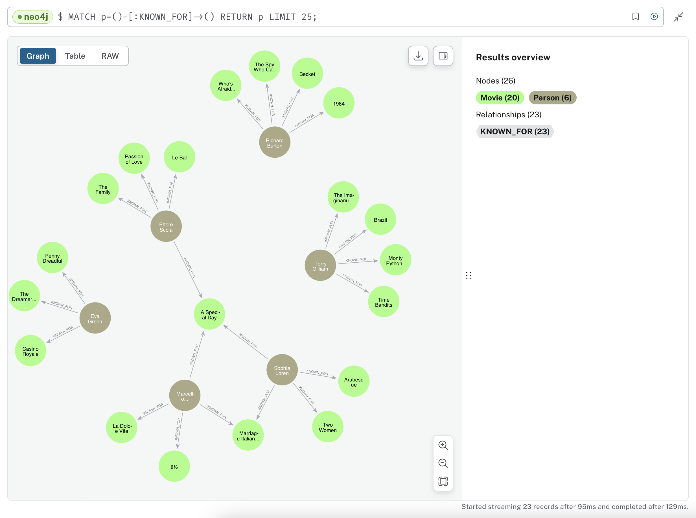

# Movie Graph

This project uses a [Concerto model](https://concerto.accordproject.org) to define the nodes and edges in a Neo4J graph database and uses the model to validate the properties on the nodes.


[Demo](src/demo/index.ts)

In a few lines of code you can define a Concerto data model validated graph and perform a vector similarity search over
nodes with text content.

Concerto model (snippet):

```
concept Movie extends GraphNode {
  @vector_index("summary", 1536, "COSINE")
  o Double[] embedding optional
  @embedding
  o String summary optional
  @label("IN_GENRE")
  --> Genre[] genres optional
}
```

TypeScript code:

```typescript
    await graphModel.mergeNode(transaction, `${NS}.Movie`, {identifier: 'Brazil', summary: 'The film centres on Sam Lowry, a low-ranking bureaucrat trying to find a woman who appears in his dreams while he is working in a mind-numbing job and living in a small apartment, set in a dystopian world in which there is an over-reliance on poorly maintained (and rather whimsical) machines'} );
    
    await graphModel.mergeNode(transaction, `${NS}.Genre`, {identifier: 'Comedy'} );
    
    await graphModel.mergeRelationship(transaction, `${NS}.Movie`, 'Brazil', `${NS}.Genre`, 'Comedy', 'genres' );
    
    await graphModel.mergeNode(transaction, `${NS}.Director`, {identifier: 'Terry Gilliam'} );
    await graphModel.mergeRelationship(transaction, `${NS}.Director`, 'Terry Gilliam', `${NS}.Movie`, 'Brazil', 'directed' );
    
    await graphModel.mergeNode(transaction, `${NS}.Actor`, {identifier: 'Jonathan Pryce'} );
    await graphModel.mergeRelationship(transaction, `${NS}.Actor`, 'Jonathan Pryce', `${NS}.Movie`, 'Brazil', 'actedIn' );
    
    const search = 'Working in a boring job and looking for love.';
    const results = await graphModel.similarityQuery(`${NS}.Movie`, 'embedding', search, 3);
```

Runtime result:

```json
[
  {
    identifier: 'Brazil',
    content: 'The film centres on Sam Lowry, a low-ranking bureaucrat trying to find a woman who appears in his dreams while he is working in a mind-numbing job and living in a small apartment, set in a dystopian world in which there is an over-reliance on poorly maintained (and rather whimsical) machines',
    score: 0.901830792427063
  }
]
```

## Install

### Download IMDB Data

Download the following (non-commercial) data sets from [IMDB](https://developer.imdb.com/non-commercial-datasets/):
- title.basics
- name.basics
- title.principals
- title.ratings

Each file is a zipped tsv (tab-separated-values) file.

### Download Wiki Movie Plots CSV

> Kaggle account is required

https://www.kaggle.com/datasets/jrobischon/wikipedia-movie-plots


### Load Data Into SQLite

> Note that on Mac OS X SQLite is installed by default. On other platforms you may have to install it manually.

```
sqlite3 im.db
```

Then in the SQLite shell, run the following commands. Run each command separately; some of the commands may take several minutes to complete:

```
.mode ascii
.separator "\t" "\n"
.import ./imdb/title.basics.tsv titles
.import ./imdb/name.basics.tsv names
.import ./imdb/title.principals.tsv principals
.import ./imdb/title.ratings.tsv ratings
.mode csv
.import ./imdb/wiki_movie_plots_deduped.csv plots

create index titles_id on titles(tconst);
create index names_id on names(nconst);
create index principals_id on principals(tconst);
create index ratings_id on ratings(tconst);
create index names_primaryName on names(primaryName);
create index principals_name on principals(nconst);
```

You should now have an ±8GB SQLite database containing most of the IMDB data, indexed for retrieval.

## Environment Variables

Export the following environment variables to your shell.

### GraphDB

- NEO4J_URL: the NEO4J URL. E.g. `neo4j+s://<DB_NAME>.databases.neo4j.io` if you are using AuraDB.
- NEO4J_PASS: your neo4j password.
- NEO4J_USER: <optional> defaults to `neo4j`

### Text Embeddings
- OPENAI_API_KEY: <optional> the OpenAI API key. If not set embeddings are not computed and written to the agreement graph and similarity search is not possible.

## Running

```
npm start
```

Then use the following commands:
- add: adds all the movies related to a specific person to the graph database
- delete: deletes all nodes from the graph database
- query: similarity conceptual search over movie nodes
- chat: converts natural language queries to graph queries
- quit: to exit